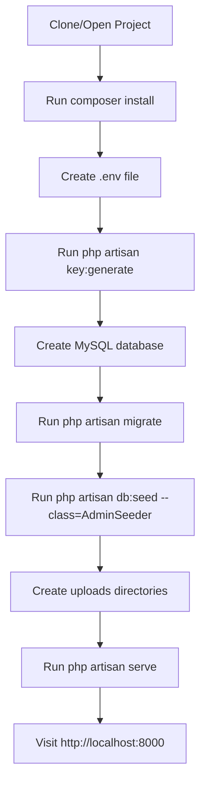

# Local Hosting & Security Fix Plan

## Project Overview

This is a **Laravel 6.x** application (PHP ^7.1.3) for a modeling agency website called **Elite Lima**. It has:
- A public-facing frontend (English + Spanish) at `resources/views/themes/main-theme/`
- An admin panel at `/admin` with its own auth guard (`auth:admin`)
- Models: Girls, Agency, Videos, Settings, Cities, Countries, Hair/Eye Colors, Pages, Constants, Users, Admins

---

## Issues Found

### 🔴 Critical Logic Issues (will break local hosting)

#### 1. Missing `.env` File
**File:** `.env` (does not exist)  
The project has no `.env` file and no `.env.example`. Without it, Laravel cannot boot — no `APP_KEY`, no DB connection, no mail config.

**Fix:** Create `.env` with:
```
APP_NAME="Elite Lima"
APP_ENV=local
APP_KEY=  (generate with php artisan key:generate)
APP_DEBUG=true
APP_URL=http://localhost:8000

DB_CONNECTION=mysql
DB_HOST=127.0.0.1
DB_PORT=3306
DB_DATABASE=elitelima
DB_USERNAME=root
DB_PASSWORD=

MAIL_DRIVER=log
MAIL_HOST=smtp.mailtrap.io
MAIL_PORT=2525
MAIL_USERNAME=null
MAIL_PASSWORD=null
MAIL_ENCRYPTION=null
MAIL_FROM_ADDRESS=noreply@elitelima.com
MAIL_FROM_NAME="Elite Lima"
```

---

#### 2. Windows Path Separator Bug in `Theme\HomeController`
**File:** [`app/Http/Controllers/Theme/HomeController.php`](app/Http/Controllers/Theme/HomeController.php:53)  
```php
$path = storage_path().'\framework\views';
File::cleanDirectory($path);
```
This uses **Windows backslashes** (`\`). On Linux/Mac this path will never resolve correctly, causing a silent failure or exception on every request.

**Fix:** Use forward slashes or `DIRECTORY_SEPARATOR`:
```php
$path = storage_path('framework/views');
File::cleanDirectory($path);
```

---

#### 3. Duplicate Route Definition for `/`
**File:** [`routes/web.php`](routes/web.php:19-33)  
```php
Route::get('/', function () {
    return redirect()->route('home');
});
// ...
Route::get('/', 'Theme\HomeController@indexES')->name('home');
```
The first anonymous closure route for `/` is immediately overridden by the second named route. The redirect to `home` creates a redirect loop since `home` IS `/`. Laravel will use the last definition, but the first is dead code causing confusion.

**Fix:** Remove the first anonymous route closure for `/`.

---

#### 4. Method Name Mismatches in Routes
**File:** [`routes/web.php`](routes/web.php:31-37)

| Route | Called Method | Actual Method in Controller |
|-------|--------------|----------------------------|
| `Route::get('/', ...)` | `indexES` | `indexEs` |
| `Route::get('es', ...)` | `indexES` | `indexEs` |
| `Route::get('models-hostess/es', ...)` | `showGirlsES` | `showGirlsEs` |

PHP method names are **case-sensitive**. These will throw `BadMethodCallException` at runtime.

**Fix:** Correct the method names in `routes/web.php` to match the controller exactly.

---

#### 5. Broken Search Query Logic
**File:** [`app/Http/Controllers/Theme/HomeController.php`](app/Http/Controllers/Theme/HomeController.php:129)
```php
$girls = Girl::where('status',1)
    ->where('hair_color',$hair)
    ->orwhereBetween('age',array($age1,$age2))
    ->orwhere('breast',$breast)
    ->orwhereBetween('height',array($hgt1,$hgt2))
    ->get();
```
The `orWhere` clauses are not grouped, so the `status=1` filter is bypassed. This returns inactive girls when any `orWhere` matches.

**Fix:** Wrap the filter conditions in a closure:
```php
$girls = Girl::where('status', 1)
    ->where(function($q) use ($hair, $age1, $age2, $breast, $hgt1, $hgt2) {
        $q->where('hair_color', $hair)
          ->orWhereBetween('age', [$age1, $age2])
          ->orWhere('breast', $breast)
          ->orWhereBetween('height', [$hgt1, $hgt2]);
    })->get();
```

---

#### 6. Missing Upload Directories
**Files:** [`app/Http/Controllers/Admin/GirlsController.php`](app/Http/Controllers/Admin/GirlsController.php:188), [`app/Http/Controllers/Admin/VideosController.php`](app/Http/Controllers/Admin/VideosController.php:144)

The code writes to `base_path()/uploads/girls`, `uploads/girls/thumbs`, `uploads/videos`, `uploads/poster` — but these directories don't exist in the repo (no `.gitkeep`). File uploads will fail silently or throw exceptions.

**Fix:** Create the directories with `.gitkeep` files:
```
uploads/
uploads/girls/
uploads/girls/thumbs/
uploads/videos/
uploads/poster/
```

---

#### 7. `config('base_url')` Does Not Exist
**File:** [`app/Http/Controllers/Auth/AdminForgotPasswordController.php`](app/Http/Controllers/Auth/AdminForgotPasswordController.php:82)
```php
$link = config('base_url') . 'password/reset/' . $token . '?email=' . urlencode($user->email);
```
`config('base_url')` is not a standard Laravel config key and is not defined anywhere in the project. This will return `null`, producing a broken reset link.

**Fix:** Replace with:
```php
$link = url('admin/password/reset/' . $token . '?email=' . urlencode($user->email));
```

---

#### 8. Unreachable Code in `AdminForgotPasswordController`
**File:** [`app/Http/Controllers/Auth/AdminForgotPasswordController.php`](app/Http/Controllers/Auth/AdminForgotPasswordController.php:96-97)
```php
} catch (\Exception $e) {
    return $e;      // returns exception object (not a response)
    return false;   // UNREACHABLE - dead code
}
```
Returning an exception object is not a valid HTTP response. This will cause a fatal error if mail fails.

**Fix:**
```php
} catch (\Exception $e) {
    \Log::error('Password reset email failed: ' . $e->getMessage());
    return false;
}
```

---

#### 9. Unused Ghost Model Imports in `Theme\HomeController`
**File:** [`app/Http/Controllers/Theme/HomeController.php`](app/Http/Controllers/Theme/HomeController.php:5-35)

The controller imports 25+ model classes that **do not exist** in the `app/` directory:
`ActiveTheme`, `AffiliateMember`, `Category`, `Client`, `ClientFeedBack`, `Discount`, `Feature`, `FormInput`, `HomeConcept`, `HomeSlide`, `InputOption`, `ItemPrice`, `MenuItem`, `Order`, `OrderPrice`, `Portfolio`, `PortfolioCategory`, `PortfolioImage`, `Post`, `PriceInput`, `Service`, `ServiceItem`, `Slider`, `Tag`

These are remnants from a previous version of the project. While PHP/Laravel won't error on unused imports at runtime (autoloader only loads when used), they are misleading and could cause issues if any method accidentally references them.

**Fix:** Remove all unused `use` statements from the controller.

---

### 🟠 Security Issues

#### 10. Public Artisan Cache-Clear Route
**File:** [`routes/web.php`](routes/web.php:13-17)
```php
Route::get('/clear', function(){
    Artisan::call('config:clear');
    Artisan::call('cache:clear');
    Artisan::call('config:cache');
});
```
This route is **publicly accessible** with no authentication. Anyone can hit `/clear` to clear the application cache and config, causing a denial-of-service or exposing the app to misconfiguration.

**Fix:** Remove this route entirely. Use `php artisan config:clear` from the CLI instead.

---

#### 11. Girl Passwords Stored in Plaintext
**File:** [`app/Http/Controllers/Admin/GirlsController.php`](app/Http/Controllers/Admin/GirlsController.php:172)
```php
$girl->password = $request->input('password');
```
The `girls` table has a `password` column and it is stored as plaintext. This is a serious security vulnerability.

**Fix:** Hash the password before storing:
```php
$girl->password = bcrypt($request->input('password'));
```
Also add the `password` field to the `$hidden` array in the `Girl` model.

---

#### 12. `Girl` Model Has No Mass-Assignment Protection
**File:** [`app/Girl.php`](app/Girl.php:1)

The `Girl` model has no `$fillable` or `$guarded` property. This means all columns are mass-assignable, which is a security risk.

**Fix:** Add `protected $guarded = ['id'];` or define explicit `$fillable`.

---

#### 13. `SettingsController` Uses Wrong Auth Guard
**File:** [`app/Http/Controllers/Admin/SettingsController.php`](app/Http/Controllers/Admin/SettingsController.php:20)
```php
$this->middleware('auth');
```
All other admin controllers use `auth:admin`. Using `auth` (the default web guard) means a regular frontend user could potentially access the settings panel if they are logged in.

**Fix:** Change to `$this->middleware('auth:admin');`

---

#### 14. reCAPTCHA Secret Key Hardcoded as Fallback
**File:** [`app/Http/Controllers/Theme/HomeController.php`](app/Http/Controllers/Theme/HomeController.php:267)
```php
$secret_key = "6LdoXpIUAAAAAIxbg_1LcghcCLK4QyQJrg3CtVW0";
```
A real reCAPTCHA secret key is hardcoded as a fallback. This should come from the `.env` file.

**Fix:** Move to `.env` as `RECAPTCHA_SECRET_KEY` and use `env('RECAPTCHA_SECRET_KEY')`.

---

#### 15. `user.ini.php` — Suspicious File
**File:** [`user.ini.php`](user.ini.php)

This file contains a full Pastebin "Page Removed" HTML page with Google Analytics tracking code (`UA-58643-34`). It appears to be a **malicious/injected file** — it has a `.php` extension but contains HTML, and the filename mimics a PHP configuration file (`user.ini`). This file should be **deleted**.

---

#### 16. `.ftpquota` File Exposed
**File:** [`.ftpquota`](.ftpquota)

This file is an FTP server quota file that reveals the server was accessed via FTP. It should not be in the repository.

---

## Local Setup Steps



### Step-by-Step

1. **Install dependencies:** `composer install`
2. **Create `.env`** from the template above
3. **Generate app key:** `php artisan key:generate`
4. **Create database:** Create a MySQL database named `elitelima`
5. **Run migrations:** `php artisan migrate`
6. **Seed admin user:** `php artisan db:seed --class=AdminSeeder`
7. **Create upload dirs:** `mkdir -p uploads/girls/thumbs uploads/videos uploads/poster`
8. **Start server:** `php artisan serve`
9. **Access admin:** `http://localhost:8000/admin/login`

---

## Summary of All Fixes

| # | File | Issue | Severity |
|---|------|-------|----------|
| 1 | `.env` (missing) | No environment config | 🔴 Critical |
| 2 | `Theme/HomeController.php:53` | Windows backslash path | 🔴 Critical |
| 3 | `routes/web.php:19-33` | Duplicate `/` route | 🟡 Logic |
| 4 | `routes/web.php:31,33,37` | Method name case mismatch | 🔴 Critical |
| 5 | `Theme/HomeController.php:129` | Broken orWhere search query | 🟡 Logic |
| 6 | `uploads/` (missing dirs) | File upload paths don't exist | 🔴 Critical |
| 7 | `AdminForgotPasswordController.php:82` | `config('base_url')` undefined | 🔴 Critical |
| 8 | `AdminForgotPasswordController.php:96` | Unreachable code / bad return | 🟡 Logic |
| 9 | `Theme/HomeController.php:5-35` | 24 ghost model imports | 🟡 Logic |
| 10 | `routes/web.php:13-17` | Public `/clear` artisan route | 🔴 Security |
| 11 | `GirlsController.php:172` | Plaintext password storage | 🔴 Security |
| 12 | `Girl.php` | No mass-assignment protection | 🟠 Security |
| 13 | `SettingsController.php:20` | Wrong auth guard (`auth` vs `auth:admin`) | 🔴 Security |
| 14 | `Theme/HomeController.php:267` | Hardcoded reCAPTCHA secret | 🟠 Security |
| 15 | `user.ini.php` | Suspicious injected file | 🔴 Security |
| 16 | `.ftpquota` | FTP quota file exposed | 🟡 Info |
